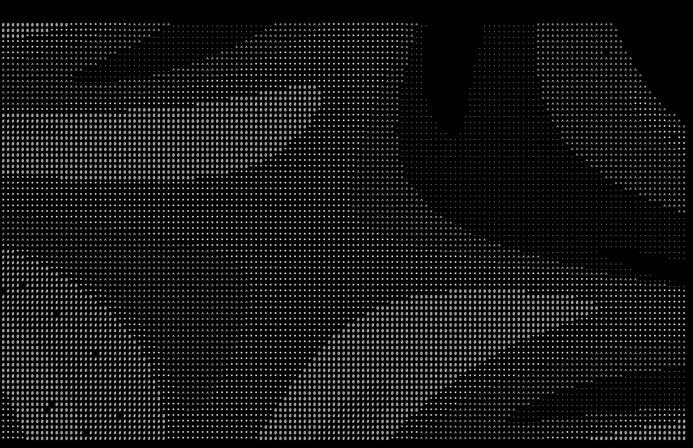
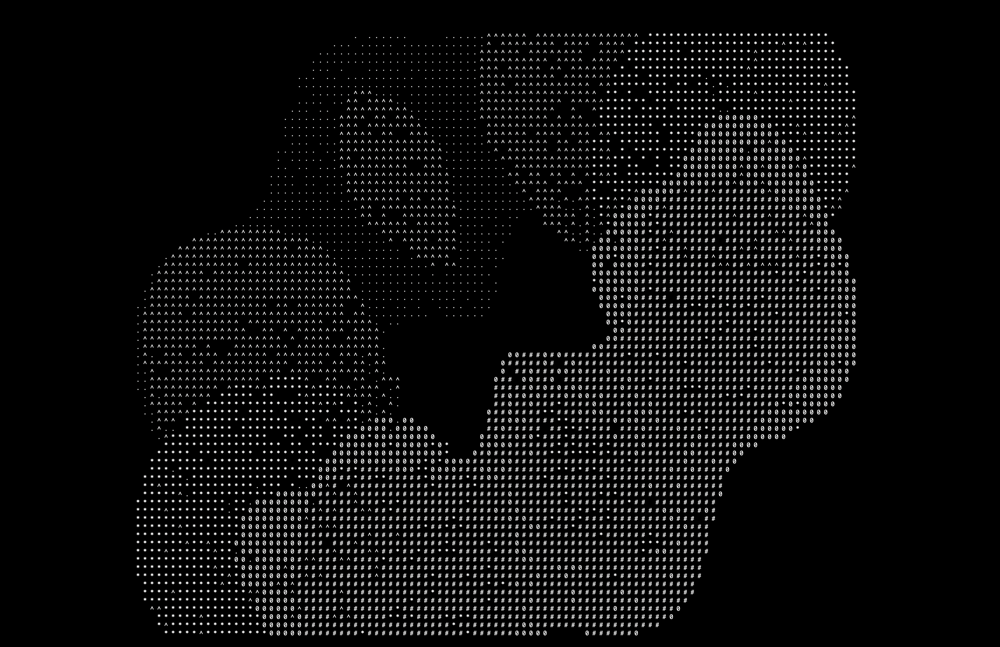
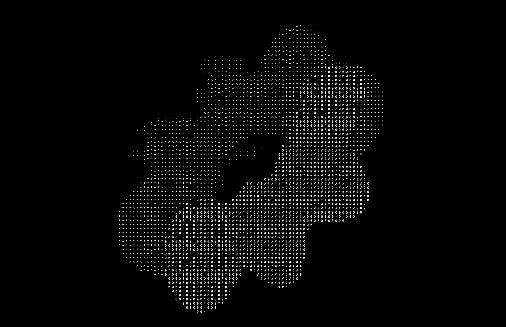

# Ascii Renderer (The Terminal Torus)

## Overview

I first got this idea when working on a [<ins>ray tracing project</ins>](https://github.com/njbizzle/RayTracingInOneWeekend), where I only ever hardcoded the equations for spheres. That had me thinking about more general surfaces, and what it would take to be able to graph them, not just triangles and spheres. More specifically a continuous parametric surface, some function that transforms a 2D plane into 3D space. This project was much more of a focus on math for me, C++ is still a language that I’m learning and I wanted to challenge myself to make use of it for this project, but the cleanliness of the code and my C++ knowledge isn't what I hope to highlight. The whole project is only a few hundred lines, but it’s very dense and a lot of thinking went into every part of the project. 

The parts that I really spent a lot of time on were the math behind the rotations, and the math behind estimating the distance from some ray to give a position and direction, and some surface living in 3D space. Though the example of the spinning donut is really specific, the structure of the program allows for really easy changes to have any surface to be graphed, any transformation combo of translation, scaling, and rotation, as well as quite a few cool camera tricks. It’s much more of a tool, the torus just demonstrates a few things it’s good at.

## Tools Used

- Cmake (for building), Clang (the compiler), and Clion (the IDE)
- Eigen (a linear algebra library)

# Examples


```                                          
                                        # # # # * 0 * 0 0 0                     
                                # 0 # 0 # # # # # # # # * 0 0 0                 
                            # # # # 0 # * # # # * * * # # # 0 ^ 0 0             
                        # # # # # # # # # * * # # # # # # # # 0 ^ 0 0           
                    # # # # # * # # # # # # * # # # # # # # # 0 0 0 0 ^         
                  0 # # * # # * # # * # # # # # # ^ # ^ # # # ^ 0 ^ 0 0 *       
              0 0 # * # # # # # * # # # # * # # # # # ^ # # . # 0 . 0 0 ^ *     
            0 # # # # # # * # # # # * * # # # # # # ^ # # . # . 0 0 0 0 ^ *     
          0 # # * * # * # # * # # * * # * # * * # # # . # # . . 0 0 . 0 * *     
          0 * # * # * * # * # # # # * # * * # # # # # . # # # 0 0 0 0 0 * * *   
        0 # # # # * * # # * # # # # # # # * # # # ^ # . # . 0 0 0 0 . 0 * * *   
      0 0 # # * # * # # * # * # # # # * * * #   # # # # 0 0 0 0 0 0 0 . * * *   
      * # # # # # # # # # # # * # # 0 0 # # # # 0 0 0 0 0   0 0 0 0 0 * * * ^   
    0 0 # ^ # # # # # # * * * # * # # 0 0       . ^ ^ *   0 0 0 0 * * * . * ^   
    0 0 # # # # # # ^ # # # # # 0 # #         . . ^ ^ * * * * * * * * * . *     
    0 0 # ^ ^ # # # # ^ ^ # # * #         . . .   ^ ^ ^ * * * * * * * * * ^     
  * ^ 0 0 # # # # # # # . # * 0       . . . . ^ ^ ^ ^ ^ ^ * * * * * * * ^ ^     
  * 0 0 0 # # . # # # # # 0 0 .   . . . . . .   ^ ^ ^ ^ ^ ^ * * * * ^ ^ ^       
  * 0 0 0 0 0 . . # . . 0 0 ^ ^ ^ ^   . .   ^ ^ ^ ^ ^ ^ ^ ^ ^ ^ ^ ^ ^ ^ ^       
  * 0 ^ 0 . 0 0 0 0 0 0 0 0 * ^ ^ ^ ^ ^ ^ ^ ^ ^ ^ ^ ^ ^ ^ ^ ^ ^ ^ ^ ^ ^         
  * 0 0 0 0 . 0 . 0   0 0 * * ^ ^ ^ ^ ^ ^ ^ ^   ^ ^ ^ ^ ^ ^ ^ ^ ^ ^ ^           
    * 0 0 0 0 0   0 0 0 * * * ^ ^ ^ ^ ^ ^ ^ ^ ^ ^ ^   ^ ^ ^ ^ ^ ^ ^ .           
    * * 0 0 0 0 0 0 0 * * * * ^ ^ ^   ^ ^ ^ ^ ^ ^ ^   ^ ^ ^ ^ ^ . .             
    * * * 0 0 0 0 0 * * * * * ^ ^ ^ ^ ^ ^ ^ ^ ^ ^ ^ ^ ^ ^ ^ . . .               
      ^ * * . * * * * * * * * ^ ^ ^ ^ ^ ^ ^ ^ ^ ^ ^ ^ . . . .                   
        ^ * . *   * * * * * ^ ^ ^ ^ ^ ^ ^ ^ ^ ^ ^ . .   . .                     
          * . * * * * * * ^ ^ ^ ^ ^ ^ ^ ^ ^ ^ . . . . .                         
            ^ ^ * * ^ ^ ^ ^ ^ ^ ^ ^ ^ ^ ^ . . . . .                             
                ^ ^ ^ ^ ^ ^ ^ ^ ^ ^ ^ . . . . .                                 
                    . ^ ^ ^ ^ . . . . .
```
```                                             
                            * * * * *                                           
                      * * * 0 0 0 0 ^ 0 0 0                                     
                    * ^ ^ 0 0 0 0 0 0 0 ^ 0 0 0                                 
                  * * . . 0 . 0 0 ^ 0 ^ ^ # # 0 0                               
                * . * 0 0 0 0 0 0 . # # ^ # # # # * 0                           
              ^ * * * 0 0 0 0 0 # # # ^ ^ # # * # # # 0                         
              * * * * 0 0 0 0 . . # # ^ # # ^ * # # # 0                         
            ^ * * * *   0 0 . 0 . # # ^ # ^ # # # # * * 0                       
            ^ * * * * 0 0     0 # # . # # # # # # # * # # 0                     
          ^ ^ * * * * 0 0 0 0 0 . # . ^ # # # # # # # # # # #                   
          ^ ^ ^ * * * * 0 0 0 0 # # # ^ # * * * * # # * # # #                   
          ^ ^ ^ * * * * * 0 0 0 0 # ^ # # * # * # # # # # # # #                 
          ^ ^ ^ ^ * * * * * * 0   # ^ # # * # # # # * * # # # #                 
          ^ ^ ^ ^ ^ * * * * * * ^ * # # * # # * * # # # # # # # #               
          ^ ^ ^ ^ ^ ^ ^ ^ ^ ^ ^ ^ . 0 # # # # * * * #   # # * # #               
          . ^ ^ ^ ^ ^ ^ ^ ^ ^ ^ ^ .   # # * # * # # # # # * # # # #             
          . ^ ^ ^ ^ ^ ^ ^ ^ ^ ^ ^ .     # # # * # # * * # # * * # #             
          . ^ ^ ^ ^ ^ ^ ^ ^ ^ ^ ^ .     # # # # # # # # # # # # 0 #             
          . . ^ ^ ^ ^ ^ ^ ^ ^ ^ ^ . .     # # # # # * # # # # * # # 0           
          . . ^ ^ ^ ^ ^ ^ ^ ^ ^ ^ .       # 0 * * # # # # # * * # # #           
            . . ^ ^ ^ ^ ^ ^ ^ ^ ^ . . .     # # # * # * # # # # * # #           
            . .   ^ ^ ^ ^ ^ ^ ^ ^ ^ . .     # # # # # # # # * # # * #           
            . . . ^ ^ ^ ^ ^ ^ ^   ^ ^ . .   # * # * # # * # # * # * #           
              . . ^ ^ ^ ^ ^ ^ ^ ^ ^ ^ ^ ^ . 0 # # # * # # # # * # # #           
              . . .     ^   ^ ^ ^ ^ ^ ^ ^ ^ * * # # # ^ # ^ * # # * 0           
                . . ^ ^ ^ ^ ^ ^ ^ ^ ^ ^ ^ ^ 0 . # # ^ ^ # # # # # # 0           
                . .   ^ ^ ^ ^ ^ ^ ^ ^ ^ * * 0 . # . . # ^ # # ^ # # 0           
                  . . ^ ^ ^ ^ ^ ^ ^ ^ * * 0 0   # # # . ^ # # # # 0 0           
                  . . ^ ^ ^ ^ ^ ^ ^ * * * 0 0 0 0 # # # # # # # # 0 0           
                    . . ^ ^ ^ ^ ^ ^ * * * 0 0 0 0 # # # # # # # ^ 0             
                      . ^ ^ ^ ^ ^ * * * * 0 0 0 0 0 . # # # 0 0 0 0             
                        . ^ ^ ^ ^ * * * * 0 0 0 0 0 . 0 0 ^ ^ 0 0               
                        . ^ ^ ^ ^ ^ * * * * 0 0 0 0 0 0 0 0 ^ 0 0               
                          . ^ ^ ^ ^ * * * * * 0 0 0 . 0 0 0 ^ 0                 
                              ^ ^ ^ * * * * * * . 0 0 0 0 0 *                   
                                ^ ^ ^ * * * * * * * * * * *                     
                                    ^ ^ ^ * * * * . * * *                       
                                          ^ ^ ^ ^ ^                             
```

## The Idea

Modern GPUs are built around using triangles, and so are most nearly all graphics frameworks, so using pre-existing tools would be difficult. I also didn't want still images in a pixel map like the [ray tracing project](https://github.com/njbizzle/RayTracingInOneWeekend), since I wanted a moving picture. The only way I knew how to truly make my own thing, was with the terminal and ascii art. The goal was to have a program that would send out a ton of rays, test the distance, and then choose an appropriately dense ascii character (not really lighting yet, more just a depth map).

When I first started thinking through the project I got stumped on finding a way to programmatically solve for the intersection between some surface and a ray sent out to test the distance from the camera. But, when doing some optimization problems for higher dimensional functions in a calculus class, I had an idea of how I might be able to estimate these points.

## Solving for the Intersections, the estim_zeros function

The setup is that I have a ray with a position and normalized direction, and then a parametric surface. So idea was to have a function taking in a ray distance and the 2D inputs to a surface, then returning a 3D vector representing the distance between where the ray ends up (given the distance) and the 3D output of the surface (given the 2D coordinates), all of which is continuous, meaning that there are simpler ways to estimate its zeros, which in this case corresponds to the ray intersecting with the surface (the distance between the 2 is zero).

I did some research on existing optimization algorithms and read about some really interesting stuff like the math behind the fsolve algorithm, which is a method called the powell hybrid method. I decided for my purposes, a multidimensional version of Newton's method would work well, despite not being the fastest option. So the program sends out a ray for each ascii character (right now there's no perspective, it all looks like an isometric drawing) and is able to estimate how far until the ray intersects a surface.

## Transformations

This drew on a part of my [Vulkan project](https://github.com/njbizzle/VulkanTutorial) that I really loved working with, which was using matrices to represent transformations. I just loved the idea of having all the information being stored so compactly in a matrix. I did a lot of the math and thinking around how to scale and translate (using homogeneous coordinates since it's a linear transformation) in that other project, but I really wanted to understand the rotation portion when reimplementing everything here.

## Quaternion Rotations, the quat_rot_homog and rotate_vec_quat functions

I had read a little bit on quaternions before and understood them on a very high level, but when it came to implementing something, I got stuck really fast. I watched quite a few lectures before finding a really awesome [video series](https://youtube.com/playlist?list=PLpzmRsG7u_gr0FO12cBWj-15_e0yqQQ1U&si=c61z5-dsT5mNspKx) of six 20 - 30 minute lectures that really took a derivation centric approach to the subject that I didn’t find in many other lectures. I was able to work stuff out in my notebook and found a way to implement everything in code. 

The reason there are 2 different implementations is because using the quaternion rotation matrix is super fast, but I wanted to have an implementation that showed more of the reasoning behind the math, since otherwise I wouldn't really have much to show for all the research I did. I made the rotate_vec_quat function, mostly just for fun to make sure that I could get my own math working. 

## Current Problems and Stuff That I’m Working On

You’ve probably noticed the noise in the displays, how occasionally there seems to be a pixel whose luminance doesn’t really line up with what you’d expect. This is because since the rays sent out can intersect at multiple points, sometimes they converge at a zero that corresponds to an intersection that lies behind a closer intersection. I minimized this by taking a few samples and getting the closest intersection, but it’s not perfect and I’d love to find a more permanent solution to this in the future.

Also the “luminance” of the surface at the moment, is really just the depth, or the distance from the camera. I want to do more of a ray tracing technique in the future, and make use of the normals to actually bounce some light around and have a way to define actual light sources, rather than just a depth map.

Speed is also a little bit of a problem. For the purpose of just being in the console and slowly spinning, it works well. But it currently is doing an insane amount of matrix inversions (which I’m pretty sure is the main source of the slowness), and I’m certain there are faster methods that either converge faster or use fewer resources.

## Additional Images





## Video of a Spinning Torus (YouTube link, click the Image)

[](https://www.youtube.com/watch?v=IRFWIjq2v08)