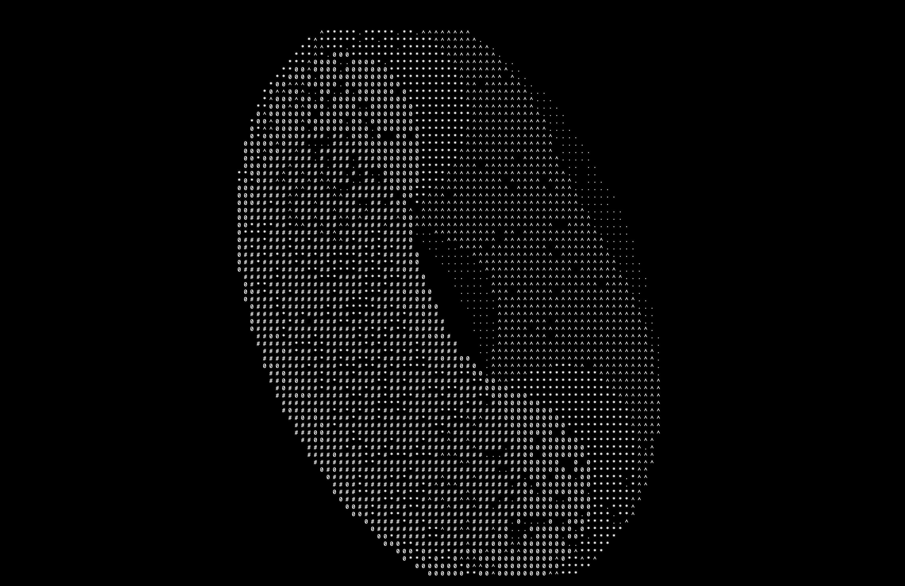

# Ascii Renderer (The Terminal Torus)

#### A terminal program that displays and transforms surfaces embedded in 3D space.

## Overview

I first had the idea to build my own rendering software while working on a separate [ray tracing project](https://github.com/njbizzle/RayTracingInOneWeekend) that rendered single images composed only of spheres. I created this to try to render more general surfaces as well as add movement to what I'm rendering. I decided to use C++, which at the time was new to me, but this was a way to get more familiar with the language. 

Some of the key challenges in this project had been finding distances to surfaces, and later transforming the 3D embedding of the surface to rotate and move the object. These problems involved estimating zeros of a large but continuous six dimensional function, in addition to plenty of research into quaternions. Despite this project only being a few hundred lines, it took a significant amount of time. I hope this project demonstrates the effort I’ve put into learning and understanding the math I used.

## Tools Used

The Eigen library for linear algebra
The C++ language
The GCC compiler for C++
CMake as a build tool
CLion as a development environment
Git/GitHub for version control

## Solving for the Surface distance, the estim_zeros function

When determining how dense any given ASCII character should be, the program takes the direction of the camera and finds the distance to the surface. Borrowing ideas from my [ray tracing project](https://github.com/njbizzle/RayTracingInOneWeekend), each character is the origin of a ray that travels out until it intersects the surface.

The ray spans a 1D subspace in 3D space, while the surface spans a 2D subspace. My idea was to have a function taking in the 1D coordinate of the ray and 2D coordinate of the surface, then returning the distance between where the ray and surface are in 3D space. The zeros of this function correspond to points where the ray intersects the surface.

Doing some research into ways to optimize for the zeros of the function, I found algorithms such as fsolve and mathematical methods such as the Powell Hybrid Method. I decided for my purposes, a version of Newton's method would be best suited for the project, despite not being the fastest converging option.

## Moving and Rotating the Surfaces 

This drew on a part of another graphics [project](https://github.com/njbizzle/VulkanTutorial) that I deeply enjoyed working on–using matrices to represent what are called transforms. Transforms act on the surfaces, taking them from a local space, where its 3D embedding lives, to a world space where many surfaces can exist. Transforms serve to displace, scale, and rotate these surfaces, and are all compactly stored in 4x4 matrices that act on homogenous coordinates, a trick allowing translation to be represented as a linear transformation. 

## Quaternion Rotations, the quat_rot_homog and rotate_vec_quat functions

My background knowledge on quaternions was limited, and when it came to implementing rotations, I ran into a lot of challenges. I want to credit my favorite resource that I found on the topic while researching, a [series of lectures](https://youtube.com/playlist?list=PLpzmRsG7u_gr0FO12cBWj-15_e0yqQQ1U&si=c61z5-dsT5mNspKx) that took a derivation centric approach that was difficult to find with resources that didn’t require much background. I was able to work through the implementation in my notebook and then translate it into code.

I opted to have two separate implementations. Making use of the quaternion rotation matrix is very practical and fast. However, I wanted to have a product that showed the effort I put into researching the topic, and the new level of understanding I gained. The ```rotate_vec_quat``` function isn’t in use, but it was a fun challenge that applied the ideas that I was learning.

## Current Problems and Future Features

Occasionally there are characters whose luminance don’t line up with what’s expected. At times there are two intersections, and the program only looks for one at a time. Occasionally the intersection that the program finds lies behind what’s expected. I minimized this problem by taking a few samples and getting the closest intersection, which causes a large loss in performance.

Also, the “luminance” of the surface at the moment is just the depth, or the distance from the camera. I want to implement lighting in the future, and make use of the normals to actually bounce light around and have a way to define actual light sources, rather than just a depth map.

For the purpose of slowly rotating a small display of a torus, the program runs decently. However, more complicated tasks take longer to render. The program is currently doing a tremendous amount of matrix inversions while making use of Newton’s method and I know there are other options that either converge faster or use fewer resources.

## Additional Images




## Video of a Spinning Torus (YouTube link, click the Image)

[](https://www.youtube.com/watch?v=IRFWIjq2v08)
